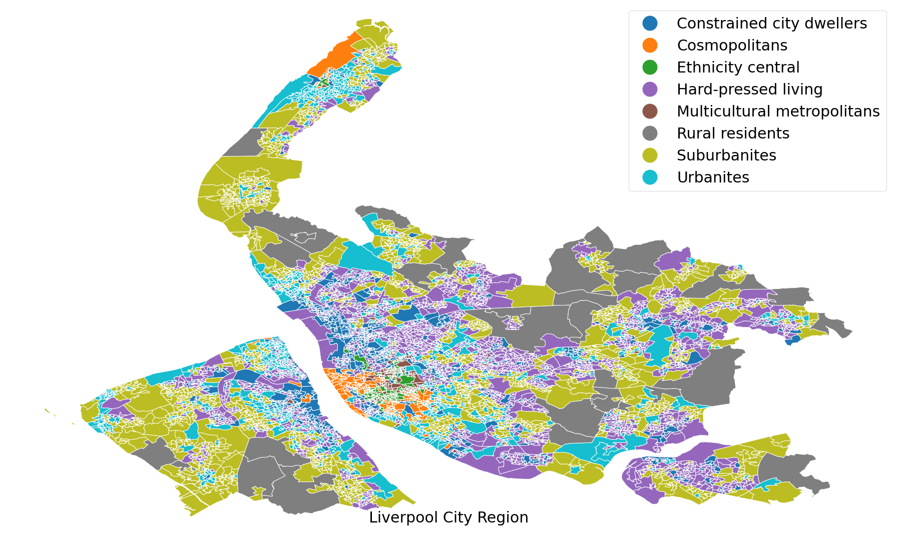
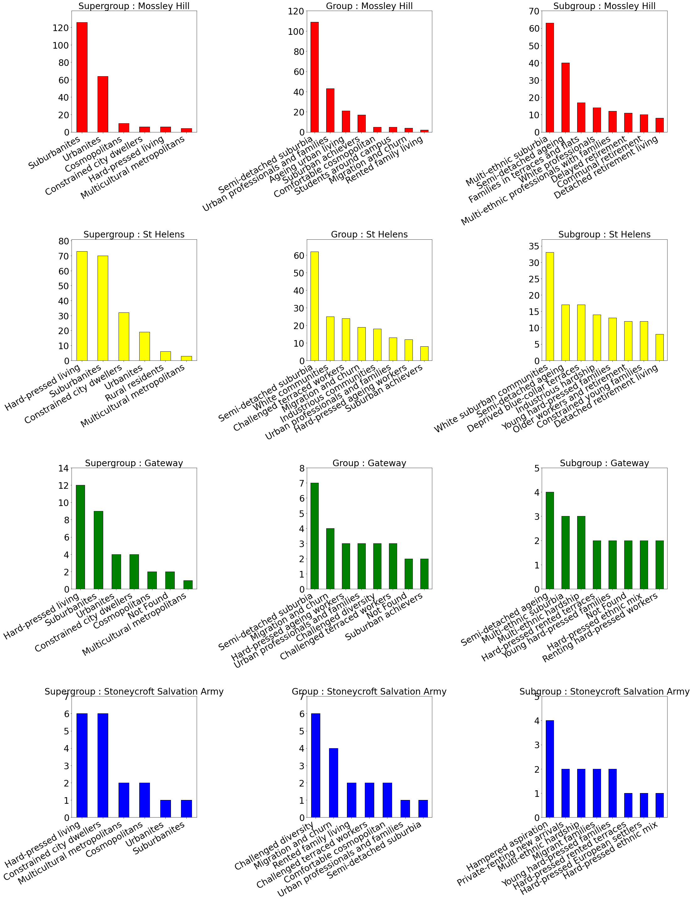
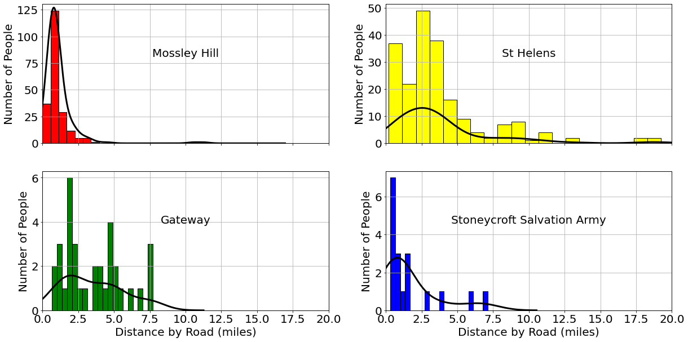
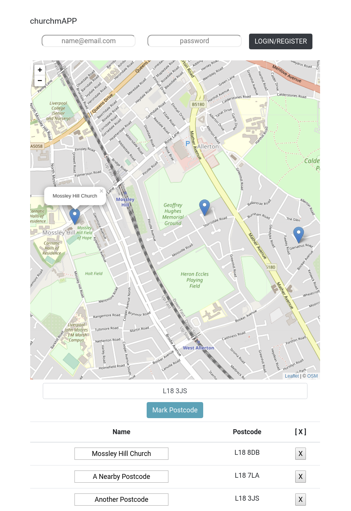

# Introduction

This is a report on a research project done as part of the Data Analytics and Society MSc/Phd that I am doing at the University of Liverpool's Geographic Data Science Lab. 

The project was to extract insight from the postcode data contained in the electoral roll (ie. the register of voting members) of Mossley Hill Church, an Anglican parish church in South Liverpool. The significance of being listed on the electoral roll can vary considerably from church to church, but the church's website declares that "Electoral rolls provide an indication of the real membership and strength of the church... For us it is an act of commitment..." [@MossleyHillChurch2020a].

Church membership and attendance statistics are much discussed in the context of claims and counterclaims about British secularization, with some arguing that at least on the evidence of declining church attendance, 'God is dead' [@SBruce2002], and others showing that there is evidence also of desecularisation in some places [@DGoodhewCooper2018]. Discussing whether and why ours is 'A Secular Age' [@CTaylor2007a] is a fascinating question, but it was not in this case a focus of my research.

Rather, my task here was more a demonstrative exploration of how postcode data might be turned into useful insight. Specifically, I explored three different (though complementary) approaches one could take to the task. First, I considered the *neighbourhood geodemographics* of the represented postcodes; second, I analyzed the travel distance between postcodes and their respective church, in the context of considering *catchment areas*; third, I developed an extendable mobile web app to allow individual interaction with postcode data in the fashion of a *data dashboard*. While I believe this does offer useful wisdom for church leaders seeking to better reach their communities, it is equally relevant to any sphere of activity interested in engaging with people in specific places. 

That said, my focus here is specifically on the Church. And since the Church is, in spite of denominational differences, a single theological entity rather than a set of competing spiritual businesses, I was able to reach out to a number of other leaders of churches in the Liverpool City Region to ask if they might be interested in my research, and if so whether they would be able to supplement my data with the postcodes of their own congregations. I was encouraged to receive swift and positive responses from St Helens Christian Life Centre [@CLC2020], [@Gateway2020], and the Stoneycroft Salvation Army [@SalvationArmy2020]. In my report here I will include results from all four churches.

# Neighbourhood Geodemographics

Geodemographics is often introduced by quoting the pithy definition of @PSleight1997 -- it is called "the analysis of people by where they live". The reverse is at least as true: geodemographics is the analysis of places by the people who live there. Specifically, a geodemographic classification is made by algorithmically clustering geoographic areas into similar groups on the basis of the demographic and socioeconomic statistics of their inhabitants, and then naming and describing each resulting group in terms of its shared characteristics. This can be done at whatever scale for which there is data -- generally, it is most useful at the finest possible scale of spatial resolution. The increasing availability of open-source statistics and of analytical computational power means it is now possible to create a geodemographic classification comparitively easily, and to tailor it to the needs of whatever particular case it is intended for; indeed, some have created systems to allow for the automatic real-time creation of geodemographic classifications on the fly [@MAdnan2011].

My aim here was simply to demonstrate the possibilities of geodemographic analysis for the purpose of helping a local church consider the value of their congregation's postcode data. For a simple proof-of-concept it was adequate to make use of an existing classification. Possibilities included commercial classifications such as Mosaic [@Experian2020] and Acorn [@CACI2020]; I chose the 2011 Open Area Classification [@CGaleEtAl2016a]. As its name suggests, it is a free and open-source classification based on data from the 2011 UK census, which classifies each census 'output area' into one of eight 'supergroups': 'Constrained City-Dwellers', 'Cosmopolitans', 'Ethnicity Central', 'Hard-Pressed Living', 'Multicultural Metropolitans', 'Rural Residents', 'Suburbanites' or 'Urbanites'. Each of these titles has a descriptive 'pen portrait' explaining in a few sentences its characteristics, and is subdivided into groups and subgroups with further relevant explanation.

This, for example, is the pen-portrait for 'Semi-detached suburbia': "People in this group are slightly more likely to be divorced or separated than those in the supergroup. Households are more likely to live in semi-detached and terraced properties, with a higher proportion of households renting their accommodation." 

Census output areas do not correlate exactly with postcode units, but a best-fit conversion can be achieved by considering which census output area the the post-code centroid falls into. 
This conversion table is published under the Open Government License[@ONS2018], and means we can identify the neighbourhood type of each person in the congregation, or even visualize the whole of, say, the Liverpool City Region, with a choropleth map (as in Figure 1) showing the supergroup classification of each output area. 
(To do this, we need the Output Area boundary *shapefiles*, which are freely available online [@ONS2016].)

When we classify the data (as in Figure 2) for Mossley Hill, we see that more than half of their congregation live in neighbourhoods that are classified within the 'Suburbanites' supergroup; of which almost all are in the 'Semi-detached suburbia' group; specifically, the 'Multi-ethnic suburbia' and 'Semi-detached ageing' subgroups. In contrast, the data from the other churches shows that their congregations are more diverse in terms of the neighbourhoods their members live in, with the top two supergroups being much closer in each case.

There is then the question of how to respond to this analysis. In retail strategy, geodemographic classification is often used with the assumption that those in similar neighbourhoods to existing customers are likely to themselves become customers. But a church is not a retail business with customers, and there is heated debate around the issue of homogenous-unit churches: are they necessary for church growth [@DMcGavran1990], or deficiently unethical [@LPope1957] -- or can they perhaps be defended on Christian ethical grounds after all [@CWagner1978].

# Catchment Area Analysis

A catchment area is "the area extent from which the main patrons of a [service] will typically be found" [@LDolegaEtAl2016]. The concept is widely used in retail, in education [@JPearce2000], and in health [@GFulopEtAl2011]. Although similarly geographical, the idea is quite different to the territorial notion of political constituencies or traditional ecclesiastical parishes where a geographical community is served exclusively by the parliamentary or priestly representative whose zone they inhabit. Rather, to think in terms of 'catchment areas' is to think in terms of an overlapping set of multiple services that both combine and compete in complex and dynamic relationship with the choices of the target community.

Within the Anglican Church, the 'Fresh Expressions' initiative [@GCray2014] has attempted to loosen the strict geographical restrictions on what new services may be pioneered in what places, allowing potential new congregations to be gathered from a widespread area. This has in turn been the target of stringent critique from others within the Church [@ADavisonMilbank2010]. Outside the Church of England, the trend goes in the opposite direction, with increasing numbers calling for intentional 'incarnational mission' [@JKilpin2014] to particular deprived and/or unchurched neighbourhoods.

For my analysis, I used the Python package OSMNx [@GBoeing2017], which makes it simple to obtain a network graph of the surrounding streets within a given distance of any coordinate point. To do this it draws data from Open Street Map [@MHaklayWeber2008], a user-generated map that now covers more than 80% of the global road network [@CBarrington-LeighMillard-Ball2017]. First, I used a postcode-coordinate conversion table created by @FreeMapTools2020 from Ordnance Survey, Royal Mail and ONS data, and then I used OSMNx to calculate the shortest distance by road from each postcode to its respective church, and then to visualize those routes on a map (Figure 3 shows that made for Mossley Hill).

The results (Figure 4) showed a clear difference between the close proximity of Mossley Hill's congregation to their church's building, and the greater geographical spread of the congregations of St Helens Christian Life Centre, Gateway Church, and the Stoneycroft Salvation Army. All of these three others are 'nonconformist' churches, which do not have the historic emphasis on the geographical parish which the Anglican church does.

# An Interactive Data Dashboard

My third attempt to do something to help church leaders extract useful insight from postcode data was more ambitious. Rather than do analysis myself that could then be passed on, I attempted to create an interactive data dashboard [@SFew2006] in the form of a mobile web app, so as to enable church leaders to directly and individually analyse their congregations' postcodes.

To do this required creating a front-end visual user interface that would send API requests to a back-end server that would enable dynamic interaction with updateable data (as shown in Figure 5). In contemporary software development, the combination of different technologies that are used to enable an application are known as 'the stack', and a software developer that is involved with both the front-end and the back-end is known as a 'full-stack developer' [@CNorthwood2018], which is variously considered an ideal to aspire to or an impossible and unhelpful myth (can any single individual truly master every layer involved in delivering a modern web application?)

I have had some prior experience in trying to develop a full-stack web application, but tried here to practise the combination of software development best practises which has become known as 'DevOps' (a portmanteau of 'Development' and 'Operations') [@MLoukides2012]: using a recognized branching methodology for source-control [@GitLab2020], and setting up the app for continual integration and deployment [@ABajpai2019].

A screenshot of the final result can be seen in Figure 6. Here an interactive slippy map is seen, using tiles made freely available by Open Street Map. The user is then able to enter a postcode and see a marker put down on the relevant position of the map. This is enabled by an API call to the server-side back-end application, which looks up the relevant latitude/longitude coordinates for the given postcode. The user is then able to label the marker, and this label is linked by the underlying Vue Javascript framework [@Vue2020] with the pop-up tag that is made visible when the marker is clicked on.

If the user wants their markers to be saved for the next time they engage with the app, then they just need to sign-up or log-in through the form at the top of the page. Implementing authentication functionality meant that I had to make sure I implemented cryptographic hashing of the passwords, so that the database is not directly storing the user's password but is nevertheless able to ascertain when a matching password is entered. It is also necessary to validate a user whose identity has already been authenticated through the form: this is achieved by the use of JSON web tokens [@MJones2011].

There is not space in this report to go into the details of how all this was implemented, but the reader is encouraged to visit the site [@churchmAPP2020] and examine the source code repository [@PPrescott2020c].

# Conclusion

I have tried in this report to give an account of my activity in putting Geographic Data Science [@ASingletonArribas-Bel2019] to the service of the local church, and to set that account in the context of the relevant academic literature. I believe I have achieved the challenge offered by the internship module specification, achieving three aims of increasing challenge.

I believe that the responsiveness to my request to other churches for postcode data shows that this is an area of work which could be of significant usefulness. However, there remains much that could still be done. Particularly regarding my attempts at developing a full-stack geographic web app, I am torn in two directions: pleased to have created a functional piece of software in a short piece of time, and disappointed that the functionality it actually offers is so minimal! But I will leave it to others to judge the merits of my efforts.

# References
